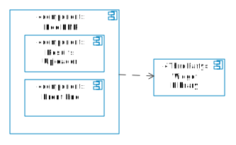
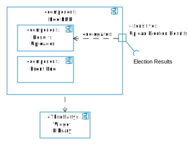

# Annotating Election Technology Architecture

<!-- TOC -->

- [Annotating Election Technology Architecture](#annotating-election-technology-architecture)
    - [Describing components](#describing-components)
    - [Annotating components](#annotating-components)
    - [What's sensitive](#whats-sensitive)
        - [Data criticality](#data-criticality)
        - [Data sensitivity](#data-sensitivity)
        - [Election operations criticality](#election-operations-criticality)

<!-- /TOC -->

This document describes how a election technology architecture can be annotated to support the core testing and verification functions of RABET-V. This document assumes a UML component diagram has been provided or constructed from an election technology vendor's documentation.

## Describing components

[Components] are defined broadly within RABET-V. This example uses the industry standard [Unified Modeling Language](https://www.omg.org/spec/UML/) (UML) [component diagrams] to describe them.

Components can be made up of other subcomponents. Ideally, sensitive components can be identified at a highly granular level, allowing the most assumptions to be made about the architecture.

*Ports* (identified by a box on the edge of a component) describes the required or provided interfaces of a component. A port can have a name, describing its logical purpose.

## Annotating components

RABET-V extends the UML Component diagrams to describe several aspects of the architecture. These aspects include:

- Sensitivity
- Security Service
- Producing Party

By annotating these aspects, we know which components of the architecture can or cannot change without requiring additional testing/validation.

Annotations are accomplished through the use of [UML stereotypes](https://en.wikipedia.org/wiki/Stereotype_(UML)). Two new stereotypes have been developed, «Security Service» and «Sensitive».

## What's sensitive

A sensitive component is one that meets the definition of **data criticality**, **data sensitivity** or **election operations criticality**.

### Data criticality

A component is data critical if any required or provided interfaces contain data that is considered critical.

The data processed by a module can be discovered by inspecting its ports. In the example below, **Election Results** interface of **Upload Election Results** is considered critical, as a malicious change in the election results is a threat to public trust.

### Data sensitivity

A component is data sensitive if any required or provided interfaces contain data that is considered sensitive. In the example below, the **Eligibility Information** interface might contain sensitive data, but it's not clear.

 Inspecting the interface in more detail shows that it includes PII.

### Election operations criticality

TBD.