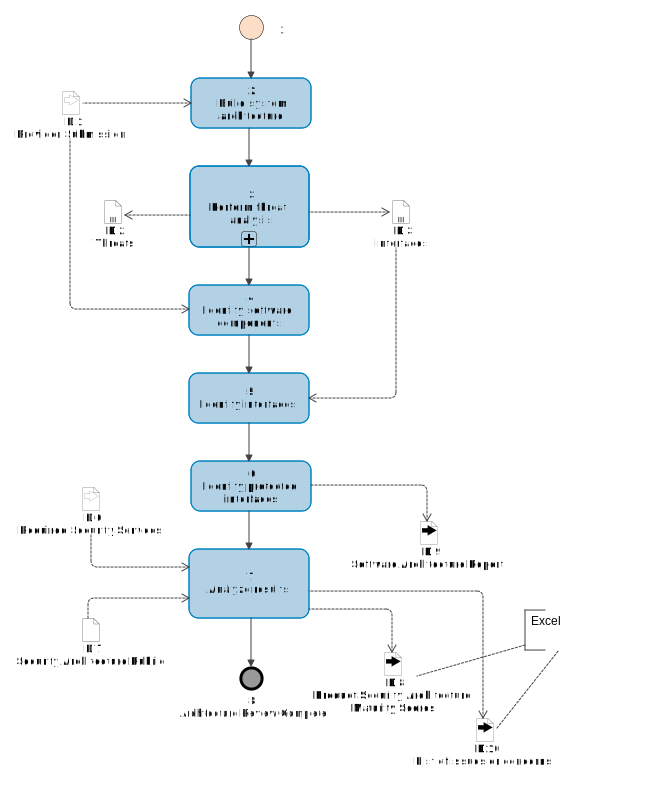

# Architecture Review Methodology

The RABET-V Architecture Review is designed to evaluate the solution’s architectural support for the [RABET-V security control families](/Overview/Security_Control_Family.md). This evaluation produces an architectural maturity score for each security control family and identifies the components which provide each [security service](/Appendices/RABET-V_Glossary.md#security-service). This score does not measure how well the [product](/Appendices/RABET-V_Glossary.md#product) executes the security service (i.e., its capability level), just how mature the architecture is that supports the security service. The [Security Services Capability Maturity](/Security_Services_Capability_Maturity_Index/README.md) level is a separate metric determined in the [Security Claims Validation](/Activities/Security_Claims_Validation.md) and it indicates how well the product provides the security services.

The Architectural Maturity scores and component mappings are used to help assess the risk that changes to the product will negatively impact the security services. These are used in the [Testing Rules Determination Activity](/Activities/Testing_Rules_Determination.md) to identify how to test the product changes. Higher architectural maturity scores, in conjunction with process maturity scores; may indicate the need for less testing required to validate that changes have not created increased risk in the product.

The Architecture Review activity is supplied with architecture diagrams, architecture descriptions, and interview sessions to confirm the architectural details and threat model the product.

> Code may be requested in the pilot in order to determine if it significantly improves the reliability of the architecture review.

For more information about what is expected for the architecture diagrams and description, see the [Provider Submission](/Activities/Provider_Submission.md) activity.

The Architecture Review will identify the product components at the system and software levels that expose functionality, and the security services that *protect* those functions.

This activity will also complete the system and software architectural viewpoints. The system level diagram identifies the larger components of the environment used to host and manage the software application(s). The software level diagrams identify the components a layer deeper into the software application(s).

## Inputs

### Provider Submission

The Technology Provider will supply architecture diagrams, architecture descriptions, software source code, and access to a functioning version of the solution. The architecture review will use the source code and functioning solution to validate or fill-in missing pieces from the architecture diagrams and descriptions. For more information about what is expected for the architecture diagrams and description, see the [Provider Submission](/Activities/Provider_Submission.md) activity.

### Required Security Control Families

The Ten [Security Control Families](/Overview/Security_Control_Family.md) provide guidance as to the needed controls to help protect the product and related data.

### Security Architecture Rubric

The rubric was created to help score the product architecture in the categories of Reliability, Manageability and Consistency, Maintainability (Modularity and Isolation), and Depth of control coverage (i.e. defense-in-depth)

## Outputs

### Product Security Architecture Maturity Workbook

These scores will be included in an architecture maturity workbook that will contain an executive summary tab, threat model results, and architecture scoring.

#### Product Security Architecture Maturity Scores

Based on the maturity scoring rubric, the architecture will be assigned scores at various levels for each security control family which corresponds to how well it supports the mitigations within that family. These scores are calculated at five layers, starting at the most detailed level of security service implementation per component or interface and resulting in a master architecture score. 

#### List of issues or concerns

Included in the workbook will be a list of threat modeling findings and any additional issues or concerns from the more detailed review of the software level architecture.

### Software Architecture Report

The Architecture Review will identify the components of the system and how the security services are used in relation to those components.

## Workflow

### 1 Start

Once the provider has completed their submission, the architecture review may start after the [process](/Appendices/RABET-V_Glossary.md#process) review or in parallel if needed and deemed feasible.

### 2 Build system architecture

[Threat](/Appendices/RABET-V_Glossary.md#threat) modeling and analysis is used to build the security architecture viewpoint. It also aids in the development of the system and software architecture diagrams. Threat modeling takes the provider submitted architectural documentation as input along with interview sessions with individuals that possess knowledge about the system and software architecture. The security control families provided by the application are enumerated using the threat modeling methodology.

The output of the threat analysis is to built out a system level architecture and to provide the first round of architecture maturity scoring at the system level. This information is then passed on to the software architecture review.

### 3 Perform threat analysis

The [services](/Appendices/RABET-V_Glossary.md#services) are then further deconstructed into [functions](/Appendices/RABET-V_Glossary.md#functions) and the data required to perform those functions. The data flows/functions may be annotated with sensitivity labels (data-critical, data-sensitive) and  (low, medium, high) which will influence the severity level determination of any identified [threat](/Appendices/RABET-V_Glossary.md#threat).

### 4 Identify software components

While the [threat](/Appendices/RABET-V_Glossary.md#threat) analysis helps identify the system-level components, the software-level components must be identified separately. This step will identify significant software architectural components, their boundaries, how they interface, their dependencies with one another and 3rd party components.

>Automated tools, such as [Lattix](https://www.lattix.com/) and [WhiteSource](https://whitesourcesoftware.com) or similar may be used to aid in this step.

### 5 Identify interfaces

The [threat](/Appendices/RABET-V_Glossary.md#threat) analysis identifies the components that need [security services](/Appendices/RABET-V_Glossary.md#security-service) and the previous step identified the software components. This step identifies the interfaces that expose component functionality. These interfaces will be mapped to security services in the subsequent step.

### 6 Identify protected interfaces

or each interface [port](/Appendices/RABET-V_Glossary.md#port), identify all the [security services](/Appendices/RABET-V_Glossary.md#security-service) that protect it (the security service's point of use). Each point of use will be scored separately, this is the most detailed layer of scoring.

### 7 Analyze results

Apply the [security service](/Appendices/RABET-V_Glossary.md#security-service) architectural maturity rubric and assign scores to each security service at its point of use.  The scores are then rolled up to security control families and ultimately to a single architecture maturity score.

> For more information please see Security Service Architectural Maturity

### 8 Architecture Review Complete

When the architecture review is completed, the outputs identified above will be distributed.