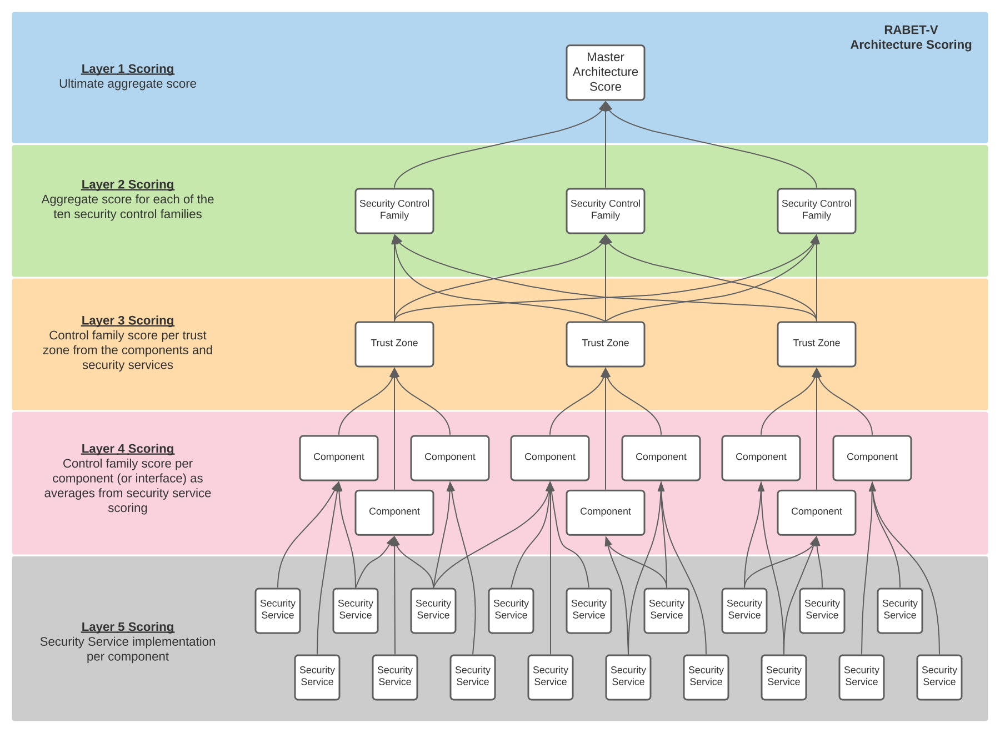

# Architecture Review Methodology

The RABET-V Architecture Review is designed to evaluate the solution’s architectural support for the [RABET-V security control families](/Overview/Security_Control_Family.md). This evaluation produces an architectural maturity score for each security control family and identifies the components that provide each [security service](/Appendices/RABET-V_Glossary.md#security-service). This score does not measure how well the [product](/Appendices/RABET-V_Glossary.md#product) executes the security service (i.e., its capability level), just how mature the architecture is that supports the security service. The [Security Services Capability Maturity](/Security_Services_Capability_Maturity_Index/README.md) level is a separate metric determined in the [Security Claims Validation](/Activities/Security_Claims_Validation.md) that indicates how well the product provides the security services.

The Architectural Maturity scores and component mappings are used to help assess the risk that changes to the product will negatively impact the security services. These are used in the [Testing Rules Determination Activity](/Activities/Testing_Rules_Determination.md) to identify how to test the product changes. Higher architectural maturity scores, in conjunction with process maturity scores; may indicate the need for less testing required to validate that changes have not created increased risk in the product.

The Architecture Review activity is supplied with architecture diagrams, architecture descriptions, and interview sessions to confirm the architectural details and threat model of the product.

For more information about what is expected for the architecture diagrams and description, see the [Provider Submission](/Activities/Provider_Submission.md) activity.

The Architecture Review will identify the product components at the system and software levels that expose functionality, and the security services that *protect* those functions.

This activity will also complete the system and software architectural viewpoints. The system level diagram identifies the larger components of the environment used to host and manage the software application(s). The software level diagrams identify the components a layer deeper into the software application(s).

## Inputs

### RTP Submission

The Technology Provider will supply architecture diagrams, architecture descriptions, and access to a functioning version of the solution. The Technology Provider process their source code through designated SBOM and software architecture analysis tools (currently [Mend](https://www.mend.io/) and [Lattix](https://www.lattix.com/)). The architecture review will use the architecture tools and functioning solution to validate or fill-in missing pieces from the architecture diagrams and descriptions. For more information about what is expected for the architecture diagrams and description, see the [Provider Submission](/Activities/Provider_Submission.md) activity.

### Required Security Control Families

The Ten [Security Control Families](/Overview/Security_Control_Family.md) provide guidance as to the needed controls to help protect the product and related data.

### Security Architecture Rubric

The rubric was created to help score the product architecture in the categories of Reliability, Manageability and Consistency, Maintainability (Modularity and Isolation), and Depth of control coverage (i.e., defense-in-depth)

## Outputs

### Product Security Architecture Maturity Workbook

These scores will be included in an architecture maturity workbook that will contain an executive summary tab, threat model results, and architecture scoring.

#### Product Security Architecture Maturity Scores

Based on the maturity scoring rubric, the architecture will be assigned scores at various levels for each security control family which corresponds to how well it supports the mitigations within that family. These scores are calculated at five layers, starting at the most detailed level of security service implementation per component or interface and rolling up to result in a master architecture score.

#### List of issues or concerns

Included in the workbook will be a list of threat modeling findings and any additional issues or concerns from the more detailed review of the software level architecture.

### Software Architecture Report

The Architecture Review will identify the components of the system and how the security services are used in relation to those components.
