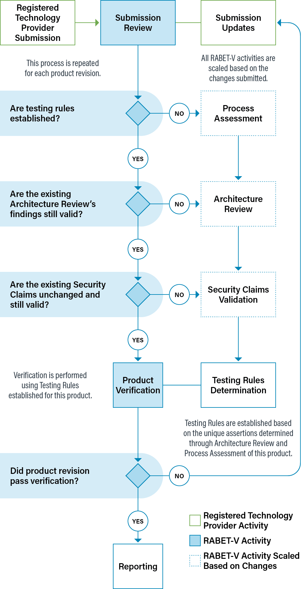

# RABET-V Activities

The RABET-V Program consists of eight discrete activities from RTP Submission to Reporting. Five of these activities scale or are eliminated based on risks attributed to the product changes from the previous submission. Risk decisions are informed by the product’s architecture, the developer’s processes, and their security claims. Each time the RABET-V process is initiated, it is called a RABET-V Iteration.

Throughout the process, certain activities produce scores that are shared with the RTP after the activity is complete. **All scores are considered tentative until the entire RABET-V process is complete.**

1.  RTP Submission: A submission from an RTP begins the RABET-V iteration. This submission contains information from the RTP on both its organization and the product under review.

1.  Submission Review: The submission is reviewed for completeness and to determine which of the remaining activities are necessary for the submission type.

1.  Process Assessment: Assessment of the RTP’s approach to developing software to determine its maturity, which will be used throughout the RABET-V process and subsequent submissions by the RTP. A demonstrably high level of maturity can reduce the burden of review across all activities. One can think of this as assessing the general trustworthiness of an RTP to reliably implement any given product feature or capability. A tentative score is provided to the RTP upon completion of the activity.

1.  Architecture Review: Assessment of the product’s architectural approach to determine its maturity with regard to various security services. A demonstrably high level of maturity can reduce the burden of review for a specific change. One can think of this as assessing the trustworthiness of the product that changes to one product feature or service will not have security implications for other aspects of the product. A tentative score is provided to the RTP upon completion of the activity.

1.  Security Claims Validation: Assessment of whether the RTP’s stated security approach are appropriate given the goals and expected use of the product. This assessment results in a set of security requirements that will used in producing the Testing Rules.

1.  Testing Rules Determination: Produces a first-hit, crosstab decision table based on the outputs from the prior activities.

1.  Product Verification: Executes the test plan.

1.  Reporting: Produces reports and provides final results to stakeholders.

