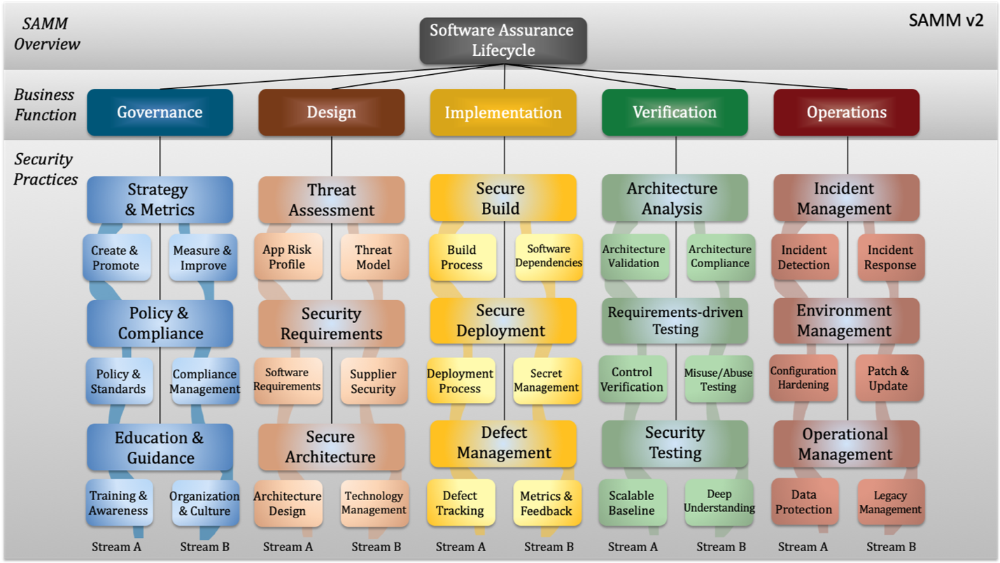

# Software Development Maturity Index

The SDM Index score is measured by the RABET-V Process Review activity and indicates the maturity of the RTP's software development processes for security and usability. The RABET-V SDM score is based on the [OWASP Software Assurance Maturity Model (SAMM)](https://www.owaspsamm.org).

Maturity scores are provided for each of the 17 software development areas (15 SAMM plus Usability and Accessibility). The scores range from 0 to 3, where 3 is the best. The graphic below represents the SAMM process with its 15 areas.

