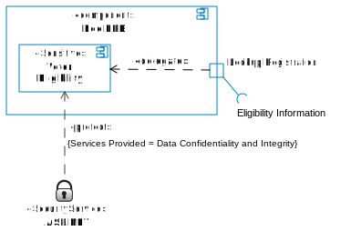

# Annotating Election Technology Architecture

<!-- TOC -->

- [Annotating Election Technology Architecture](#annotating-election-technology-architecture)
    - [Describing components](#describing-components)
    - [Annotating components](#annotating-components)
        - [What's sensitive](#whats-sensitive)
            - [Data criticality](#data-criticality)
            - [Data sensitivity](#data-sensitivity)
            - [Election operations criticality](#election-operations-criticality)
        - [Security Services](#security-services)
        - [Third Parties](#third-parties)
    - [Importance of Decomposition](#importance-of-decomposition)

<!-- /TOC -->

This document describes how an election technology architecture can be annotated to support the core testing and verification functions of RABET-V. This document assumes a UML component diagram has been provided or constructed from an election technology vendor's documentation.

## Describing components

[Components] are defined broadly within RABET-V. This example uses the industry standard [Unified Modeling Language](https://www.omg.org/spec/UML/) (UML) component diagrams to describe them.

Components can be made up of subcomponents (shown as nesting inside its containing component). Ideally, sensitive components can be identified at a highly granular level, allowing the most assumptions to be made about the architecture.

*Ports* (identified by a box on the edge of a component) describes the required or provided interfaces of a component. A port can have a name, describing its logical purpose.

## Annotating components

RABET-V extends the UML Component diagrams to describe several aspects of the architecture. These aspects include:

- Trust Boundaries
- Security Services provided by Component
- Producing Party of Component

By annotating these aspects, we know which components of the architecture can or cannot change without requiring additional testing/validation.

Annotations are accomplished through the use of [UML stereotypes](https://en.wikipedia.org/wiki/Stereotype_(UML)). The new stereotypes that have been developed include «protect», «Security Service»,  «ThirdParty», among others.

### What's sensitive

A sensitive component is one that meets the definition of **data criticality**, **data sensitivity** or **election operations criticality**.

#### Data criticality

A component is `data-critical` if any required or provided interfaces contain data that is considered critical.

The data processed by a component can be discovered by inspecting its ports. In the example below, the **Election Results** interface of **Upload Election Results** is considered critical, as a malicious change in the election results is a *threat* to public trust.

#### Data sensitivity

A component is `data-sensitive` if any required or provided interfaces contain data that is considered sensitive. In the example below, the **Eligibility Information** interface might contain sensitive data, but it's not clear.

 Inspecting the interface in more detail shows that it includes PII.

#### Election operations criticality

A component is `operations-critical` if a component's degradation of function or ceasure of function would be disruptive to the election operations it supports. This is determined by reviewing the use-cases that the component supports.

### Security Services

Security services are used to secure «Sensitive» components. While sensitivity labels identify the need for security properties (e.g. *Confidentiality*, *Integrity*, *Availability*), a security service provides them. Which services are provided by a security service is expressed by the *Services Provided* tag on the «protect» *dependency*. A security service is often provided by a «ThirdParty».

### Third Parties

A third party component is a component not produced in any part by the election technology provider. Many products rely on third party components to provide common functionality, including security services. A component is indicated by the use of the «ThirdParty» stereotype. A *Vendor* tag is used to indicate the provider.

## Importance of Decomposition

In order to minimize the amount of testing, annotations should be applied to specific subcomponents.

Consider Foo Election Night Reporting (ENR). The user must be authorized before they can upload a new set of election results. The component diagram does not specify a particular subcomponent as requiring this security service, so the entire component (i.e. Foo Admin) must be classified as sensitive.

Suppose the Base Admin Controller provides the authentication services. Then the sensitivity level can be moved "down" into that subcomponent.

A better architecture would be to isolate the Authorization Module from the other components as shown below.

The diagram doesn't show under what circumstances EnrAuth is used. It could be all the time, or just for some of the endpoints / behaviors exposed by the controller. To make that more clear, we create a port called "Upload Results" which exposes an HTTP endpoint and consumes the EnrAuth service. The labels are now narrowed down to the most granular level.

