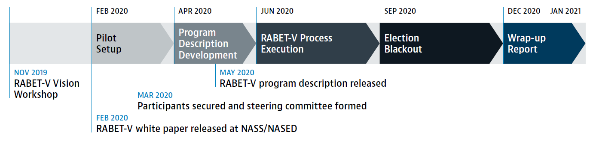
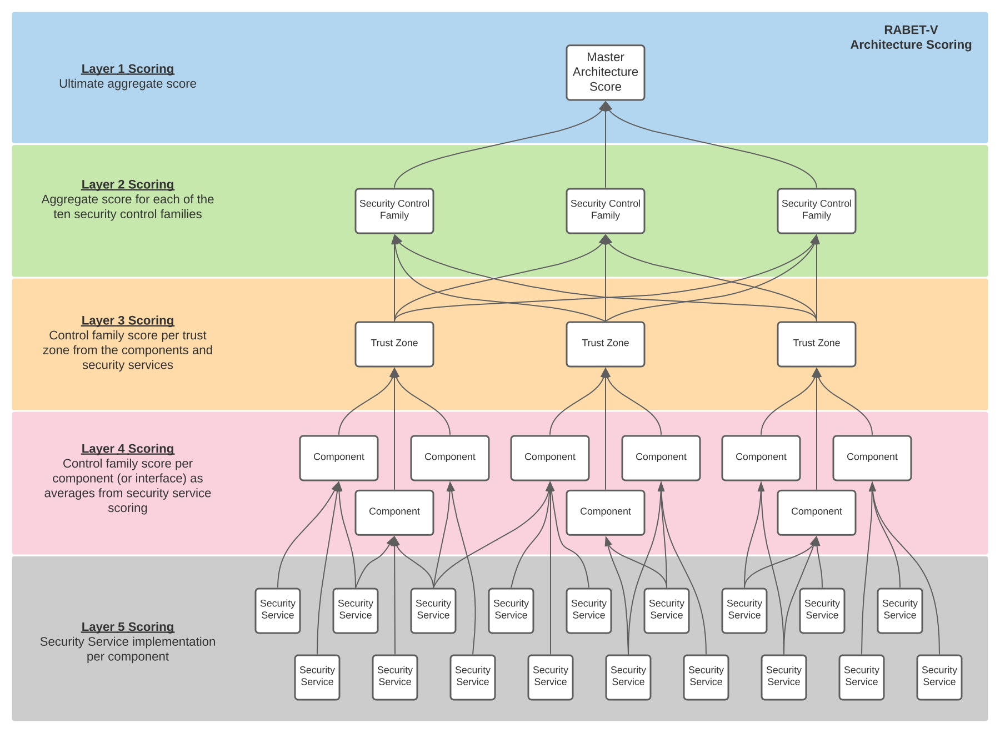

# Pilot Program Recap  

In this section, we provide a recap of the pilot program and discuss several of the challenges faced. For each challenge, we discuss the solution we implemented during the pilot or propose for future efforts.

## Background

In 2019, the Center for Internet Security (CIS) began work to fill gaps in the security of non-voting election systems. There are both voting and non-voting types of election systems. A 'voting system' is defined in the Help American Vote Act ([Public Law 107-252](https://www.congress.gov/107/plaws/publ252/PLAW-107publ252.pdf)). A non-voting system is any other election technology system used to administer an election. Examples include voter registration databases, electronic pollbooks, and the websites of government election authorities.

First, CIS developed the [Security Best Practices for Non-Voting Election Technology Guide](https://www.cisecurity.org/wp-content/uploads/2019/11/Security-Best-Practices-Non-Voting-Election-Tech-Singles-19-Nov.pdf) to provide a comprehensive set of security best practices. At the conclusion of that effort, CIS began working on a process to verify election technology against those best practices. This effort produced the concept of Rapid Architecture Based Election Technology Verification (RABET-V).

After receiving input from various stakeholders in November of 2019, CIS developed the RABET-V framework and released it in a white paper titled [How to Improve Election Technology Verification](https://www.nass.org/sites/default/files/2020-01/white-paper-cis-nass-winter20.pdf) during the 2020 Winter Conference of the National Association of Secretaries of State.

Based on the RABET-V Framework and with financial support from the Democracy Fund, CIS launched the first pilot of RABET-V in February 2020. The RABET-V Pilot Program was guided by a steering committee comprised of election officials, election technology providers, and other election infrastructure stakeholders. The steering committee included representatives from the states of Indiana, Maryland, Ohio, Pennsylvania, Texas, and Wisconsin. Representatives from the Election Assistance Commission (EAC), Cybersecurity and Infrastructure Security Agency (CISA), National Association of State Election Directors (NASED), and the Federal Voting Assistance Program (FVAP) further comprised the steering committee.  Two technology providers volunteered their products and time to participate in the pilot. Knowink submitted their electronic pollbook, PollPad. VR Systems submitted their electronic pollbook, EViD, and their election night reporting solution. CIS also engaged with a group of technology experts who comprised a RABET-V technology advisory committee.

The RABET-V Pilot first established a RABET-V Program Description. The Program Description is a detailed guide on how to run RABET-V. It was developed in early 2020 and was iteratively reviewed and modified by the core team and program Steering Committee as necessary.

Using the Program Description, the Pilot Program conducted initial iterations on the technology providers' products. Each initial iteration of RABET-V executed all activities resulting in the creation of maturity scores for each product and a testing matrix to guide future iterations.

## Challenges and Resolutions

Throughout the pilot, the team encountered various challenges, both logistical and technical in nature. This section recaps those challenges and how the team addressed them during the pilot or proposes to address them in future RABET-V efforts.  

### Organizing Requirements and Efforts

During the pilot, it became apparent we needed a concise way to define and organize the RABET-V efforts beyond the process activities defined in the framework. We decided to define ten Security Control Families (sometimes referred to as security services) that are used throughout RABET-V to help evaluate the product. These families organize the requirements, architecture evaluation, verification testing, and results and are defined in the Program Description.

### Results for Multiple Audiences

During the development of RABET-V, we learned that various states want different types of results from a central testing and verification program. Some states want a decision on whether the product version is acceptable or not. Other states want more details and raw results in order to make a decision themselves on whether the product version's security is acceptable or not. Based on our interactions, the larger, better funded states want to process the raw results and the smaller states perform a decision be made by the verifier.

RABET-V attempts to address these various needs by
1. Organizing the results into three maturity indexes that reflect the results from the process assessment, architecture review, and the verification activities of the RABET-V process, and
2. Providing a single verification decision to serve as a baseline that can be used or ignored by a state election jurisdiction.

The three maturity indexes are the Software Development Maturity (SDM) Index, the Security Service Architectural Maturity (SSAM) Index, and the Security Service Capability Maturity (SSCM) Index. Each index is described below.

#### Software Development Maturity (SDM) Index

The SDM Index score is measured by the RABET-V Process Review activity and indicates the maturity of the provider's software development processes for security and usability. The RABET-V SDM score is based on the [OWASP Software Assurance Maturity Model (SAMM)](https://www.owaspsamm.org).

Maturity scores are provided for each of the 17 software development areas (15 SAMM areas plus Usability and Accessibility). The scores range from 0 to 3, where 3 is the best.

#### Security Service Architectural Maturity (SSAM) Index

The SSAM index provides scores that indicate how well the product's architecture is built to support each security control family. This is a measure of the reliability of the security service and how isolated the security service is from other system changes. These maturity scores are measured during the RABET-V Architecture Review.

The SSAM Index provides a maturity score for each of ten security control families. The scores range from 0 to 3, where 3 is the best.

#### Security Service Capability Maturity (SSCM) Index

The SSCM index identifies the product's current capability level measured across the ten security control families and provides a maturity score for each family. The scores range from 0 to 3, where 3 is the best.

The scores are based on how well the product revision meets the security requirements set forth for each security control family. The requirements are pass/fail. Any assumptions made about the configuration or setup of the product are documented with the result.

### Visibility of Results

Throughout the pilot, we discussed the question of the visibility of the testing results. There are many competing approaches to this and it is something that should be investigated in future RABET-V efforts. Our proposal defines four audiences:
1. the public,
1. subscribers, consisting of state and local election offices,
1. technology providers,
1. and partners, entities in the community with whom the Administrator may share some information about findings.

While we do not make a final recommendation on the visibility for each of these stakeholder groups, we suggest some options to consider in later discussions.

__Public__

- RABET-V process documentation - this includes all of the information about how RABET-V is run
- Registered Technology Provider (RTP) name and contact information - we define the concept of a Registered Technology Provider (RTP) in the Program Description
- The name and version number of each product and product revision that has completed or is currently going through the RABET-V process
- Change list for each product version
- The verification decision for each product revision that has completed the RABET-V process
- For each product revision, the top-level average for each of the three maturity indexes

__Subscribers__

- Test matrix and testing methods used for each product version
- Mid-level scores for maturity index--e.g., index scores across each of the ten security services
- Verification results by security requirement

__Technology Providers__

- Detailed testing notes and component level evaluations
- Architecture diagrams and other artifacts developed during the RABET-V process
- Reproduction steps for weaknesses or vulnerabilities found

__Partners__

We envision a role for partners like the Cybersecurity and Infrastructure Security Agency (CISA) and other information sharing partners. We believe the level of information may vary by partner, but generally includes things like summary and trend information about verification findings with the hope that this will inform national-level responses without revealing specific information about any given product or provider.

### Converting Best Practices to Requirements

RABET-V is not specific to any set of requirements. In fact, it can be used with any appropriate security requirements and the Administrator may choose to apply different requirements in different environments, as described later in this section.

We choose to start with the best practices published as the [Security Best Practices for Non-Voting Election Technology](https://www.cisecurity.org/wp-content/uploads/2019/11/Security-Best-Practices-Non-Voting-Election-Tech-Singles-19-Nov.pdf). This guide was developed by CIS in collaboration with a community of election vendors, election IT staff, and other technology experts.

Best practices generally do not have the specific, measurable details that are necessary for conformance evaluations. In order to test against the best practices, we converted them into security requirements.

We also noticed that there was overlap between some of the security requirements and the process assessment. Since the requirements were used to measure the Security Service Capability Maturity, we removed the process oriented requirements from the SSCM to avoid duplication.

Finally, we mapped each requirements to one of the ten security service families and assigned each requirement a maturity level of 1, 2, and 3. The Security Service Capability Maturity index is calculated from the number of applicable requirements were verified for the product.

The applicability of the best practices will vary for each type of technology verified under RABET-V. For instance, some requirements specific to web services won't be appropriate for some election technology while others, such as those specific to physical devices, may be appropriate for other election technology. Each type of election technology will have a set of requirements tailored to its function in the election environment. This applicability should be reviewed regularly and will be the portion of RABET-V process that changes the most for different types of election technology.

The final set of requirements along with their assigned security service family and maturity level is found in the Requirements Master Workbook in the Supporting Documents.

### Inventing an Architecture Review Methodology

As the 'architecture-based' part of the name indicates, RABET-V puts a significant emphasis on the product architecture with the intent for the architectural maturity to determine the level of testing performed on the product. Entering the pilot, we had broad buy in from technical stakeholders that this was possible, but we did not have a method of determining architectural maturity for this purpose. While there are many architecture review processes, the team was unable to identify one that evaluated architectures to determine the risk of changes to security outcomes. This left the task to the project team.

Our first proposal, outlined in the initial Program Description, created two streams of effort. The first stream focused on system level analysis using threat modeling. The second stream relied on software analysis to identify and map software level components to security services. The initial approach used the system level analysis to inform the software level analysis and produced scores predominately at the software level. We ended, however, with an approach where the software level analysis informed the system level and the scores were driven primarily from the system level. This is an important distinction that made the analysis much more reliable. This is most evident in the changes we made to the Security Service Architecture Maturity rubric. The initial version of the rubric discussed the *construction* and *usage* around security services and the language was written almost entirely from a software perspective. The final version is organized by reliability, maintainability, manageability, and depth, a much more system-driven approach.

In fact, one key decision made in the development of the final Security Service Architecture Maturity rubric was that better architectures rely as much as possible on dedicated and isolated components distinguishable at the system level. Realizing that this is not possible for all security services, the rubric has accommodations for the security services we believed required some level of configuration or integration with the solution's custom software. We called these composite services, an example of which is a Security Information and Event Management service, while those that we believe should be completely isolated we called transparent services, such as a firewall.

The rubric also considers the complex nature of systems with components and sub-components. It does this by calculating scores at five layers, starting at the most detailed level of security service implementation per component or interface and resulting in a master architecture score. Then, the rubric has a unique category for *depth*, a top-down view over the whole architecture. In this manner, the architecture maturity score is a reflection of both bottom-up and top-down perspectives.

To support our analysis, we used three software tools. We used a software architecture management tool called Lattix, a security and license compliance management tool called WhiteSource, and a software modeling tool called MagicDraw.

Lattix performs analysis on the software solution using either source code or executable code and builds a dependency matrix. This illuminates how the system is constructed without having to perform direct source code analysis. We worked with each provider to identify the software modules related to each security control family, and then we analyzed the internal and external dependencies of each of those modules.

Separately, Lattix provides a change analysis capability. This highlights the software modules which have been updated from the prior version and can provide detailed listing of added, removed, and updated elements within each module. We did not use this feature in this initial pilot but believe it has great potential benefits in RABET-V for product iterations.

WhiteSource provided additional insight into the 3rd party dependencies of the systems. Specifically, it identified the 3rd party versions used and whether those versions were reasonably updated or had known security vulnerabilities.

MagicDraw was our selected modeling software to document the system architectures. MagicDraw component diagrams were useful in creating scores for various components. Initial setup was very time consuming but should be reusable as a template.  We documented some of our usage of MagicDraw in several documents which can be found in the Supporting Documents area of this report: Understanding Architecture Review Diagrams and Scoring with MagicDraw. There is also a sample MagicDraw project called Sample Arch Review.

We believe there are many opportunities to improve the efficiency of the architecture review process but, even as executed, it proved a valuable and reliable method for understanding the quality of a product's design. In this pilot, we focused on developing a rubric and methodology that was sustainable and would produce consistent results. The next step is developing better instructions and tooling so that technology providers can prepare diagrams and perform some analysis themselves prior to initiating the RABET-V process.

### Incorporating Usability and Accessibility

RABET-V is primarily intended to be a verification of product security. However, we heard early on from stakeholders that its value to the election community would be increased substantially if it also provided a measure of the usability and accessibility. We attempted to solve for this in the initial Program Description by expanding the process assessment to include usability and accessibility process maturity. The assessment establishes feedback loops as the basic level of maturity and more automated and more formal testing indicating higher levels of maturity. Each provider in the pilot was evaluated with this assessment.

While we think this approach is good for usability, we know it is lacking for accessibility. Due to the nature of accessibility requirements, we believe it is possible to incorporate actual evaluation of the accessibility of a product into RABET-V without changing the overall approach or timeline for conducting a verification.

We believe the approach to accessibility testing should use both automated and manual methods. Both are currently needed since even the best available automated tools identify only small portion of known errors, produce false positives, and have difficulty assessing how well solutions are implemented. Functional testing with commonly used assistive technology must also be required. Similar to how we approach security, the manual methods will be used for the initial evaluation and for high risk changes. The automated testing will be used for lower risk product updates.    

As an alternative to a risk-based approach, a sampling approach is also viable. As it will not be reasonable to audit everything, the sampling approach can be used identify how much of an application must be reviewed for the accessibility audit.  Although some automated tools can spider an entire site and give some useful information about accessibility, a certain sample of pages must still be selected for in-depth and manual testing. It is important that this sample is representative of content throughout the application, especially any interactive functionality with voters.  The RABET-V Program Description must provide direction for how the access audit must be scoped so a sufficient number of content and templates are reviewed to provide a representative sample of the overall platform and content (e.g., frequently used content like login, variety of content types, content with forms/tables/charts/graphics, interactive sites that use scripts or process user input, etc.). Most systems include both a template that holds the content and a database that populates the actual content to populate the template and create the page. When auditing these dynamic pages, it is important that the template and content, as well as the generated page, are audited.

Another important factor to accessibility testing are the requirements for the accessibility auditor. As with other specialty areas of RABET-V, the accessibility auditing should be overseen by an organization or person with the requisite expertise and experience, addressing the attributes below.

__Experience__

- The length of time that the vendor been doing accessibility audits
- Whether accessibility audits are their primary business
- Whether they have experience with audits of very large online applications and their approach to sampling pages and prioritizing to ensure a valid review
- Whether they have conducted audits within the educational or instructional area

__Expertise__

- The specific skills, education, and work experience of the auditor
- The specific software platforms and applications with which the testers have experience, such as programming expertise in accessibility, HTML, ARIA, and expertise with assistive technology and interoperability testing.)

__Testing Methods__

- The specific automated and manual testing methods used to evaluate accessibility
- How is testing conducted with commonly used assistive technology
- Whether individuals with disabilities who use assistive technology are included in the audit as testers

We would like to thank Dr. Diane Golden for her assistance with this section.  

### Documentation Challenges

The initial Program Description outlined a basic set of documentation requirements. However, the core team avoided requiring the participating technology providers to develop new documentation to meet those requirements. This was done for three reasons: 1) we did not want to delay the start of the pilot to wait for new documentation, 2) we were looking for reasonable ways to reduce the burden on our participating providers, and 3) we were not confident we were asking for the right documentation. Instead, we took the documentation they developed for other certification efforts - such as those performed by the State of New York - and we mapped the documentation to our requirements.

In truth, this effort was not effective and being more prescriptive would not have helped either. Due to the nature of our efforts, we relied heavily on interview-based data collection techniques. We interviewed management, architects, developers, and others to collect the information we needed. Reviewing their documentation while conducting these interviews revealed a few things about documentation requirements:

1. Documentation will always be a lagging indicator of process or product maturity
2. The time spent reviewing documentation is equal to or greater than conducting interviews
3. Reviewers can often obtain greater depth about the process and product from interviews than from documentation

Due to this, we have devalued traditional documentation requirements in the RABET-V Program Description with two exceptions:

1. User documentation. As opposed to technical documentation, user documentation is far more insightful for reviewers and its accuracy is a better indicator of product maturity. Reviewers find it helpful to provide context to product construction. We also believe it provides better ROI for technology providers than technical documentation, the latter of which is difficult to keep updated, often not used for technical evaluations, and has no value beyond the technical evaluation.
2. Visual, annotated architecture diagrams. During the pilot, we developed a series of architecture diagrams based on the data we collected primarily through interviews. These became the basis for our system understanding and the architecture maturity scoring. We have developed guidance on how technology providers can create these diagrams themselves. If the technology providers can present quality annotated architecture diagrams to RABET-V to verification and validation, this will greatly reduce the amount of time necessary to conduct an architecture review. Additional guidance and examples are necessary to fully equip providers to do this.

### Handling System Configurations and Variations

During the pilot, it became apparent that each of the systems could be configured with various levels of security controls based upon the customer's requirements or preferences. This created a challenge for expedited evaluations. We certainly could not evaluate each variation during a pilot, nor would that be ideal in an operational version of RABET-V as well.

We determined the best approach was to have the technology provider define the specific configuration they wanted to present for verification. We decided to document the configuration choices and present those along with any scores. States and localities then could fully understand the context of the scores they were seeing, and make any configuration modifications with those in mind. For example, if the technology provider choose to submit a less secure variation, the scores would be lower but provide more flexibility for the state or locality to make safe and secure configuration changes. If the technology provider choose to submit a more secure variation, the scores would be higher but would force the state or locality to increase their security risk with configuration changes.

This is an area that needs more exploration to determine the most effective way to handle multiple configurations of the same product.

### Developing Testing Tiers and Matrix

RABET-V was developed on the concept that testing would vary based on the risk of the product changes made, thus allowing&mdash;and creating incentives for&mdash;smaller, more manageable changes. This meant that we needed to define testing levels and identify exactly how they would be applied. The chosen approach had to ensure that appropriate rigor is applied based on the risk created by the change.

To start, we began by developing testing levels. We decided to do this at the requirements level and vary the level of testing by varying the testing method used. We defined three testing tiers: Full, Basic, and Streamlined. Testing methods included Functional Testing, Data Audit, Penetration Testing, Configuration Audit, Documentation Review, and Artifact Review. One or more testing method was assigned to each tier for each requirement. The definitions of the testing methods and their assignment to each requirement are found in the Requirements Master Workbook of the Supporting Documents.

With the testing levels developed, we needed a consistent way to assign the testing level to the specific product revision. We decided that this needed to be done based on type of change(s) made to each security service, coupled with the relevant architectural and software development maturity scores. Based on the type of change(s) to each security service component(s), a testing tier would be determined for those security service requirements. For example, if there were low risk changes made to the authentication components, the testing tier assigned would be *streamlined*. This means the streamlined testing methods would be used for each of the authentication requirements. The streamlined testing methods may vary for each requirement because certain requirements can only be tested in certain ways but, for each requirement, the process testing method chosen would be appropriate based on the low risk of the change.

To capture this, we built a list of change types and a master matrix that calculates risk from the change type, process assessment score, and the architectural maturity score. This calculation results in a recommended testing tier. The master matrix and examples are available in the Security Service Testing Matrix Workbook of the Supporting Documents.

There are several subtleties to this solution of testing tiers and a testing matrix. First, the approach encourages technology providers to develop and maintain robust automated testing capabilities. This is because many of the streamlined and basic testing tiers use the Artifact Review test method with many of the acceptable artifacts produced from automated tools or first party testing; effectively the technology provider submits evidence of having submitted the tests themselves. If the technology provider can not produce those artifacts, the more intensive testing tier is used. Second, the approach encourages providers to submit smaller product revisions. This is accomplished with the ordered change list we developed (with higher risk items appearing earlier in the list and requiring more extensive testing). RABET-V will select the change type most appropriate for each security service. If more than one change type applies, the higher one on the list is selected. This discourages bundling of changes into large releases and encourages small, more specific updates.

### Conducting a Pilot During a Pandemic and Major Election Year

As one reviews this pilot effort, it is important to recall that we conducted the pilot during a presidential election year and during a global pandemic. The challenges presented by the election were known ahead of time, and we understood that the operational demands on our participating technology providers and steering committee members would be priority over the pilot efforts. The pandemic further exacerbated these challenges by removing people from the typical work environments, forcing all interactions to be done remotely, and limiting the number of people who could physically test the devices.

These challenges primarily impacted the pilot timeline, and not the effectiveness or reliability of actual results. We estimate that we lost three months to General Election activities between September and December, but we also saw impacts in the Spring and Summer as many states were delaying their primaries and shifting their voting models to more vote-by-mail approaches. These changes took significant efforts from our steering committee members and participating providers. In fact, we had interest from two other technology providers early on who were unable to continue to participate as the pilot got started.

Perhaps the most significant impact of these challenges was that we were unable to complete our initial plan of performing both an initial iteration of RABET-V and a subsequent product revision iteration. Instead, we were only able to complete the full initial iteration for each of the three products. Performing a full initiation iteration allowed us to completely define and test the RABET-V Program Description, evaluate the effort required for testing, obtain actual process and product maturity scores, obtain preliminary cost estimates, and evaluate the risk-metrics produced. However, by not completing a follow up product revision iteration, we are unable to make definitive claims about how the risk-based approach will streamline product updates, the time those updates will take, and cost of those updates. Gathering that necessary information will have to be done in subsequent RABET-V efforts.
